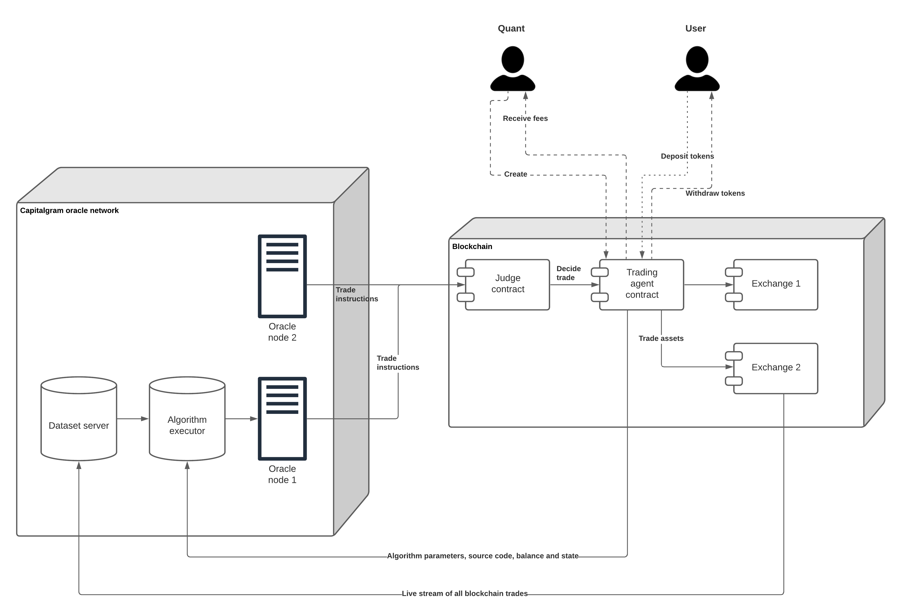

Decentralised trade execution overview
======================================

Preface
-------

Capitagram protocol offers fully decentralised trade execution for algorithms.

Benefits
--------

* **Easy**: Smooth user experience of investing in algorithm with a single click without sign up.

* **Low risk**: No risk with counterparties: exchange and broker insolvency, hacks, frontrunning or other maliciously trading against the service investors.

* **Trustless**: Anyone can validate and backtest that algorithms are running correctly and there is no malice in fee distribution or taking profits that do not belong to oneself.

* **Scalable**: Decentralised network can be efficiently scaled up simply by just adding more nodes. Because the network relies solely on :term:`on-chain` data, anyone can start a new oracle node to improve the network resiliency, performance and earn commissions.

* **Incentived**: Decentralised protocol allows efficient incentive models to capture more value in the ecosystem that would be possible on traditional business models.

* **Open source**: The source code is open, making finding and hiring talent cost efficient.

* **Private**: No one can sell your financial data for profit and no one can use this data against you, e.g. as blackmail or doxxing.

* **Resilient**: The blockchain and peer-to-peer based system is more immune to network issues, like Internet blackouts, denial of service attacks, ransomware attacks and such. Whereas traditional financial services guarantee technical security by heavily investing to risk mitigation through policies, a decentralised service guarantees technical security through being disruption immune through sufficient decentralisation.

Overview
--------

Oracles
~~~~~~~

Capitalgram network consists of oracle nodes. Oracles have two functions

* Read blockchain and and manage :term:`candle` :term:`dataset` that serves as a source for
  algorithms to make decision. This function is not much different from any other market data service that
  solicites and distributed trading data, e.g. like the popular TradingView. The only major difference is oracles
  use trading data that is solely sourced from a blockchain. This makes it possible for anyone to launch and run an oracle, as there is no barrier to entry like buying expensive data feed licenses.

* Execute algorithms, also referred as a :term:`strategy`:, themselves: read market data , read algorithm state, decide on the next trade, send trade instructions to trading agents.

Oracles co-ordinate trades for algorithms on a blockchain. The blockchain can be any third party blockchain that supports smart contracts. All oracle-to-oracle communication happens over the blockchain and there is no peer-to-peer network.

Trading agent and algorithms
~~~~~~~~~~~~~~~~~~~~~~~~~~~~

Algorithms are published on a blockchain, as a smart contract. Each algorithm consists of

* The source code of the algorithm

* Foundational parameters that cannot be changed

* Dynamic parameters that can be adjusted within the the scope of foundational parameters: e.g. the maximum allowed deposits limit

* Stored user assets (ETH, UDSC, ERC-20 tokens, etc.)

*Trading agent smart contracts* co-ordinate between algorithms, investors, deposits and risk paramers. When an algorithm is paired with a smart contract enabled execution it becomes :term:`autonomous agent` that trades on the behalf of investors. In a sense, the agent acts as a hedge fund, but without management.

Users can deposits and withdraw in *trading agents* in real-time. There is no counterparty risk with agents or exchanges - in the case the algorithm malfuctions, the users can withdraw assets matching the current trade portfolio and sell the assets themselves.

Judges
~~~~~~

The blockchain has as *judge smart contract* that receives trade instruction inputs from multiple oracles. The judge acts as a filter; in the case any oracle is malfuctioning or sending out malicious trade instructions, multiple oracles vote on the result. In the case voting cannot reach agreement the judge simply does nothing and no trades are done.

Blockchains
~~~~~~~~~~~

Any smart contract based blockchain is supported. In the start, the protocol starts popular EVM based blockchains like Ethereum mainnet, Polygon and Binance.

Stakeholders and ecosystem participants
---------------------------------------

There are three major stakeholders in the ecosystem

* **Investor-users** deposit their assets in trading agents to earn yield and make profit. Anyone can become an investor.

* **Quants** and other algorithm vendors create new trading algorithms and receive % as the profit share. Even if you do not have your own capital, but are able to create market beating algorithms, you can efficiently make large amount of profit. Anyone can become an algorithm vendor.

* **Operators** run oracles. Operators need specialised IT, cloud service and data center knowledge. Operators do not need any finance knowledge. Operators are incencitived to run the oracle network as high quality and cost efficiently as possible, as the operator profit. Anyone can become an operator.

Fee sharing
-----------

The fee sharing model can be decided agent-by-agent. Here is an example what fee sharing protocol could look like:

* 0.5% transactional fee for investments that is

    * 0.2% on deposit

    * 0.3% on withdraw

The fee is distributed to the stakeholders so that

* 40% goes to the algorithm vendor

* 40% goes to the protocol treasury

* 10% goes to the user referrals and marketing partners

* 10% goes to oracle operators

Risks
-----

Algorithms are open source and rely on 100% public data. Investors themselves accept the risk of the algorithm making losses when they deposit into a trading agent. Investors do not take risk with any counterparty, as any actions happening after the deposit are purely mathematical and out from the human intervention.

Because everything is open, it is easy to come up with current performance, backtesting and other numbers. Investors are even encouraged to fiddle with the parameters to come up with better performance characters, like less maximum drawdown.

There still always exists a systematic risk with nascent decentralised finance markets smart contract technology. As the data and source code for all markets are public, investors can also quantify this risk. Though unlike financial model risk, technological failure risk is harder to quantify.

Private algorithms
------------------

In the case the algorithm vendor does not want to publish the source code their algorithm, they can only use the *trading agent contract* to offer deposits and withdraws for third parties to invest in their algorithm. In this case, the algorithm vendor is responsible for running their own oracle network. As the users cannot verify the algorithm source code directly, they need to to trust the algorithm vendor to do the trade decisions for themselves.
