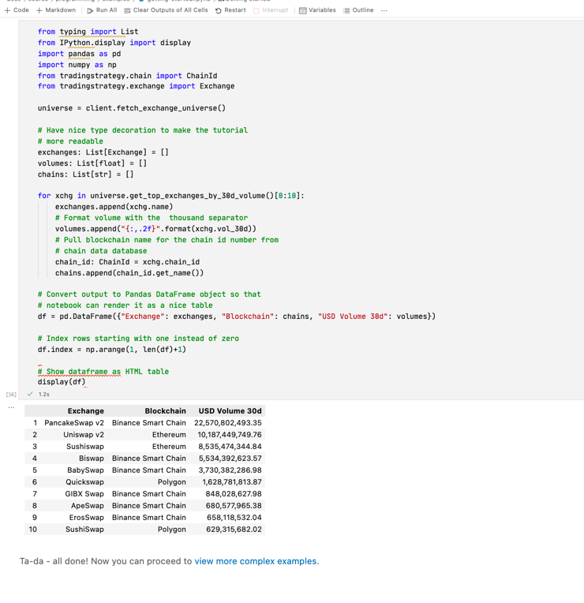

Running examples
================

Preface
-------

The documentation contains various notebooks for

* How to use Trading Strategy API

* How to develop your own automated trading strategies

Google Colab
------------

This is the easiest method to start your research if you are not familiar with Python.

Click "Open Colab" badge on the top of the example page in the documentation. You need a Google account. A Google cloud server will be automatically allocated for you to run the code. Currently Colab servers are free.

Visual Studio Code
------------------

This is the recommended method for advanced strategy development.

Install `Jupyter Visual Studio Code extension <https://code.visualstudio.com/docs/datascience/jupyter-notebooks>`_. Choosing a black-on-white theme recommended, because the default charts assume white background.

Git clone the `Trading Strategy client repository from Github <https://github.com/tradingstrategy-ai/client/>`_.

Install the client and its dependencies using `Poetry <https://python-poetry.org/>`_:

.. code-block:: shell

    cd client
    poetry shell
    poetry install

Configure Visual Studio Code to use Python interpreter from Poetry installation.

First in Poetry shell figure where Poetry installed the Python interpreter:

.. code-block:: shell

    which python

This gives you the full path of `python` command.

::

    /Users/moo/Library/Caches/pypoetry/virtualenvs/tradingstrategy-lMEetNwg-py3.8/bin/python

Then use Visual Studio Code *Python: Select Interpreter* command from *Command palette* to configure this interpreter by choosing *Enter interpreter path* option for the interpreter.

Now you can run `Getting started <https://tradingstrategy.ai/docs/programming/examples/getting-started.html>`_ and other example notebooks. Open `ipynb` file in Visual Studio Code. Then choose *Run All* on the open notebook.

Local Jupyter Server
--------------------

Writing your own notebook
~~~~~~~~~~~~~~~~~~~~~~~~~

TODO

[Get an example as a starting point from Github](https://github.com/miohtama/capitalgram-onchain-dex-quant-data/tree/master/docs/source).

Check `examples and `algoritms` folder.

Save `.ipynb` file locally.

Editing examples
~~~~~~~~~~~~~~~~

This is the best method if you want to edit the existing examples in the project.

Take a git checkout.

Install using poetry.

.. code-block:: shell

    poetry install

Then start Jupyter server at the root folder.

.. code-block:: shell

    ipython notebook

Navigate to a file you want to edit in your web browser.

Terminal IPython
----------------

You might want to run notebooks in a terminal using `ipython` command e.g. for better debugging facilities.

You can run example notebooks in a terminal after git checkout and poetry install:

.. code-block:: shell

    ipython --TerminalIPythonApp.file_to_run=docs/source/examples/getting-started.ipynb

This is especially useful if you want to use `ipdb` or other well-established Python command line debuggers.